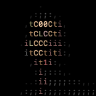
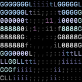
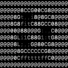

# ASCII Roulette
👾 ascii video chat client

[](https://raw.githubusercontent.com/dialupdotcom/ascii_roulette/master/LICENSE)
[](https://travis-ci.org/dialupdotcom/ascii_roulette)
[](https://goreportcard.com/report/github.com/dialupdotcom/ascii_roulette)
[](https://godoc.org/github.com/dialupdotcom/ascii_roulette)

## Installing

The fast way:
```sh
# Paste this command into your terminal to install
bash <(curl https://dialup.com/ascii)
```

From source:
```sh
git clone https://github.com/dialupdotcom/ascii_roulette.git
cd ascii_roulette
make
```

## Contributors

[](https://github.com/maxhawkins)
[](https://github.com/Sean-Der)
[](https://github.com/djbaskin)
