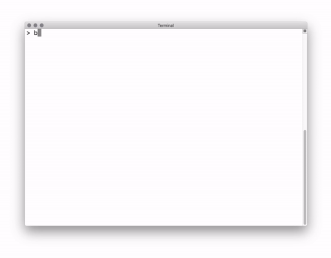

# ASCII Roulette

> 👾 Make friends on the command line!

[](LICENSE)
[](https://travis-ci.org/dialup-inc/ascii)
[](https://goreportcard.com/report/github.com/dialup-inc/ascii)
[](https://godoc.org/github.com/dialup-inc/ascii)

<p align="center">
  
</p>
<p align="center">Chat with a random person without ever leaving your terminal window.</p>

## Installation

**Download the fast way:**

```sh
# Paste this command into your terminal to install
bash <(curl https://dialup.com/ascii)
```

**Or, build from from source:**

```sh
git clone https://github.com/dialup-inc/ascii.git
cd ascii
make
```

## Contributing

Contributions and bug reports are welcome! Please check [the issues section](https://github.com/dialup-inc/ascii/issues) before submitting.

We are looking for help developing a [Windows port](https://github.com/dialup-inc/ascii/issues/13).

#### Our Contributors

[](https://github.com/maxhawkins)
[](https://github.com/Sean-Der)
[](https://github.com/djbaskin)

## Copyright

Code and documentation copyright 2019 [Dialup, Inc.](https://dialup.com)

Code released under the [MIT license](LICENSE).

[webmaster@dialup.com](mailto:webmaster@dialup.com)
